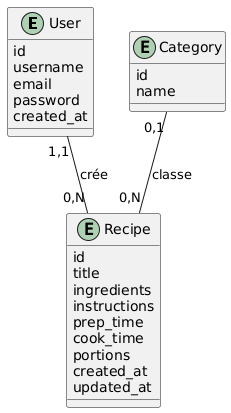
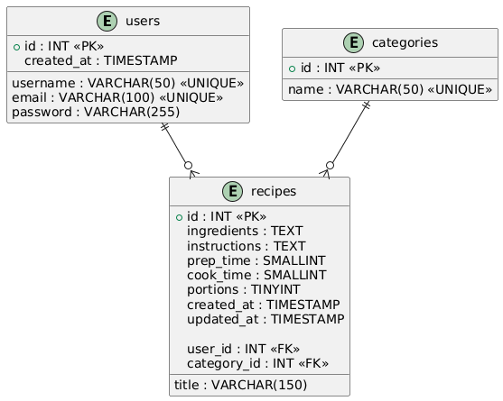

# 🍽️ Marrakech Food Lovers

**Marrakech Food Lovers** est une application web moderne de partage de recettes de cuisine marrakchie. Conçue avec une architecture **MVC (Modèle-Vue-Contrôleur)** en PHP pur, elle offre une interface utilisateur élégante et intuitive inspirée du design système de *MangerBouger.fr*.

## 🚀 Fonctionnalités

- **Authentification Sécurisée** : Inscription et connexion des utilisateurs avec hachage des mots de passe.
- **Gestion des Recettes (CRUD)** :
    - Création de recettes détaillées (ingrédients, instructions, temps de préparation).
    - Modification et suppression par l'auteur.
    - Affichage optimisé des détails d'une recette.
- **Gestion des Catégories** : Organisation des recettes par thématiques (Entrées, Plats, Desserts...).
- **Filtrage Dynamique** : Système de filtres par badges pour naviguer rapidement entre les catégories de recettes.
- **Design Responsive** : Interface totalement adaptative (Desktop & Mobile) basée sur **Bootstrap 5**.

## 🛠️ Stack Technique

- **Backend** : PHP 8.x (Architecture MVC, POO).
- **Base de données** : MySQL via PDO (Pattern Singleton pour la connexion).
- **Frontend** : HTML5, CSS3, JavaScript (Bootstrap 5, Bootstrap Icons).
- **Polices** : Montserrat & Inter (Google Fonts).

## 📂 Structure du Projet

```text
marrakech-food-lovers/
│
├── 📄 index.php                    ← ROUTEUR PRINCIPAL (Point d'entrée)
├── 📄 README.md                    ← Documentation du projet
├── 📄 .gitignore                   ← Fichiers à ignorer par Git
├── 📄 shema                       ← Structure du projet (ce fichier)
│
├── 📂 config/                      ← CONFIGURATION
│   ├── Database.php                ← Singleton de connexion PDO
│   └── db.sql                      ← Script SQL (Base & Tables)
│
├── 📂 controllers/                 ← CONTRÔLEURS (Logique métier)
│   ├── AuthController.php          ← Authentification & Sessions
│   ├── RecipeController.php        ← Gestion des recettes (CRUD)
│   └── CategoryController.php      ← Gestion des catégories (CRUD)
│
├── 📂 models/                      ← MODÈLES (Accès aux données)
│   ├── User.php                    ← Modèle Utilisateur
│   ├── Recipe.php                  ← Modèle Recette (avec filtres)
│   └── Category.php                ← Modèle Catégorie
│
├── 📂 views/                       ← VUES (Interface utilisateur)
│   ├── 📂 layouts/
│   │   ├── header.php              ← Barre de navigation & CSS
│   │   └── footer.php              ← Pied de page & Scripts
│   │
│   ├── 📂 auth/
│   │   ├── login.php               ← Page de connexion
│   │   └── register.php            ← Page d'inscription
│   │
│   ├── 📂 recipes/
│   │   ├── index.php               ← Listing & Recherche
│   │   ├── create.php              # Formulaire de création
│   │   ├── edit.php                # Formulaire de modification
│   │   ├── show.php                # Détails de la recette
│   │   └── delete.php              # Confirmation de suppression
│   │
│   └── 📂 categories/
│       ├── index.php               ← Listing des catégories
│       ├── create.php              # Créer une catégorie
│       ├── edit.php                # Modifier une catégorie
│       └── delete.php              # Confirmation de suppression
│
└── 📂 public/                      ← FICHIERS STATIQUES (Assets)
    ├── 📂 css/
    │   └── style.css               ← Design système "Manger Bouger"
  
```
## 📊 Modélisation des données

### Modèle Conceptuel de Données (MCD)


### Modèle Logique de Données (MLD)


## ⚙️ Installation

1. **Clonage du projet** :
   ```bash
   git clone https://github.com/farahar2/Marrakech-Food-Lovers.git
   ```

2. **Configuration de la base de données** :
   - Importez le fichier `config/db.sql` dans votre gestionnaire MySQL (ex: phpMyAdmin).
   - Vérifiez les identifiants de connexion dans `config/Database.php`.

3. **Lancement** :
   - Placez le dossier dans votre serveur local (XAMPP, WAMP, MAMP).
   - Accédez à `http://localhost/Marrakech_Food_Lovers`.

## 🎨 Design System

L'application suit une charte graphique orientée sur la fraîcheur et la santé :
- **Couleur Primaire** : Vert Marrakech (#76c043)
- **Couleur Secondaire** : Orange Safran (#f39200)
- **Typographie** : Montserrat (Titres) et Inter (Corps de texte)

---
*Réalisé avec ❤️ par la communauté Marrakech Food Lovers.*


